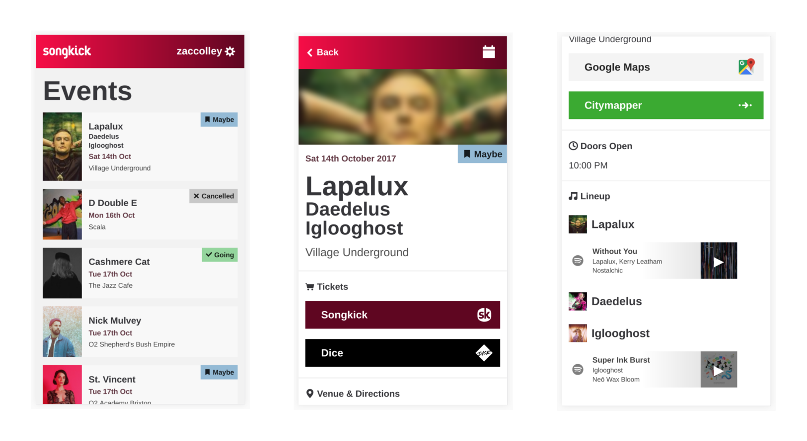

# [songkick.pink](https://songkick.pink)
_:nail_care: experimental progressive web app for songkick_

[](https://travis-ci.org/zaccolley/songkick.pink) [](https://david-dm.org/zaccolley/songkick.pink)
[](https://david-dm.org/zaccolley/songkick.pink?type=dev)
[](https://greenkeeper.io/)
[](https://snyk.io/test/github/zaccolley/songkick.pink)



## Installation

**1. Clone this repo and install any dependancies:**

```sh
yarn install
```

or

```sh
npm install
```

**2. Add in environment variables:**

You'll need the following to be added to `.env` (see `.env-sample`):

1. Songkick API key (SONGKICK_API_KEY): https://www.songkick.com/developer
2. Server IP Address (SERVER_IP): `hostname -I`

## Development Workflow

**3. Start a live-reload development server:**

```sh
npm run dev
```

> This is a full web server nicely suited to your project. Any time you make changes within the `src` directory, it will rebuild and even refresh your browser.

**3. Generate a production build in `./build`:**

```sh
npm run build
```


**5. Start local production servers:**

```sh
npm start
```

---

_based on the preact boilerplate: https://github.com/developit/preact-boilerplate_
